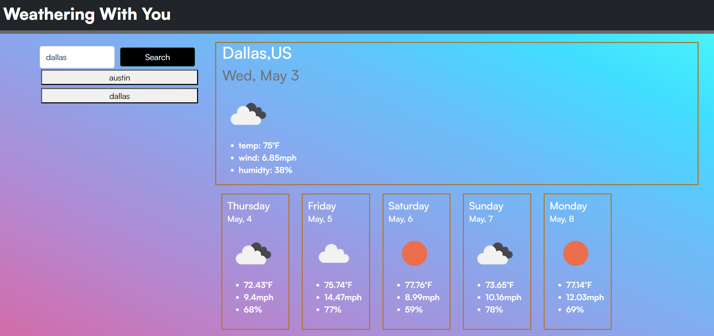

# Weathering With You

## Description
This website presents weather information for various cities worldwide. All you need to do is enter the name of the city, and the page will display the corresponding weather data. Furthermore, the website saves your recent searches in local storage, enabling you to quickly revisit any city you have previously searched for by selecting it from the "Recent" list.

## Installation 
search weather near you: https://cristian01021.github.io/BestWeahterApp/

## Usage
type in the location of your choosing. 
 

## Credits 
These two video helped me further understand what i needed to do and how to attack this work:  https://www.youtube.com/watch?v=WZNG8UomjSI

https://www.youtube.com/watch?v=w0VEOghdMpQ 

Tutor: Andrew H.

All weather data is provided by OpenWeather  (https://openweathermap.org/api)